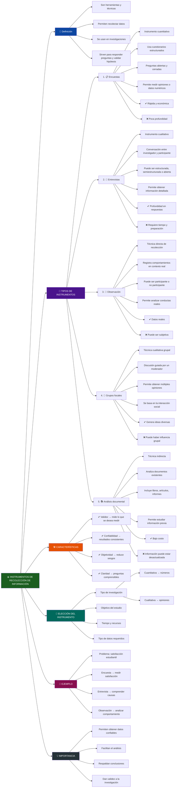

```mermaid
flowchart LR
    A[📊 INSTRUMENTOS DE RECOLECCIÓN DE INFORMACIÓN]

    %% Definición
    A --> B[📌 Definición]
    B --> B1[Son herramientas y técnicas]
    B --> B2[Permiten recolectar datos]
    B --> B3[Se usan en investigaciones]
    B --> B4[Sirven para responder preguntas y validar hipótesis]

    %% Tipos enumerados
    A --> C[🧩 TIPOS DE INSTRUMENTOS]

    C --> C1[1. 📋 Encuestas]
    C1 --> C1A[Instrumento cuantitativo]
    C1 --> C1B[Usa cuestionarios estructurados]
    C1 --> C1C[Preguntas abiertas y cerradas]
    C1 --> C1D[Permite medir opiniones o datos numéricos]
    C1 --> C1E[✔ Rápida y económica]
    C1 --> C1F[❌ Poca profundidad]

    C --> C2[2. 🎤 Entrevistas]
    C2 --> C2A[Instrumento cualitativo]
    C2 --> C2B[Conversación entre investigador y participante]
    C2 --> C2C[Puede ser estructurada, semiestructurada o abierta]
    C2 --> C2D[Permite obtener información detallada]
    C2 --> C2E[✔ Profundidad en respuestas]
    C2 --> C2F[❌ Requiere tiempo y preparación]

    C --> C3[3. 👀 Observación]
    C3 --> C3A[Técnica directa de recolección]
    C3 --> C3B[Registra comportamientos en contexto real]
    C3 --> C3C[Puede ser participante o no participante]
    C3 --> C3D[Permite analizar conductas reales]
    C3 --> C3E[✔ Datos reales]
    C3 --> C3F[❌ Puede ser subjetiva]

    C --> C4[4. 👥 Grupos focales]
    C4 --> C4A[Técnica cualitativa grupal]
    C4 --> C4B[Discusión guiada por un moderador]
    C4 --> C4C[Permite obtener múltiples opiniones]
    C4 --> C4D[Se basa en la interacción social]
    C4 --> C4E[✔ Genera ideas diversas]
    C4 --> C4F[❌ Puede haber influencia grupal]

    C --> C5[5. 📚 Análisis documental]
    C5 --> C5A[Técnica indirecta]
    C5 --> C5B[Analiza documentos existentes]
    C5 --> C5C[Incluye libros, artículos, informes]
    C5 --> C5D[Permite estudiar información previa]
    C5 --> C5E[✔ Bajo costo]
    C5 --> C5F[❌ Información puede estar desactualizada]

    %% Características
    A --> D[🛠️ CARACTERÍSTICAS]
    D --> D1[✔ Validez → mide lo que se desea medir]
    D --> D2[✔ Confiabilidad → resultados consistentes]
    D --> D3[✔ Objetividad → reduce sesgos]
    D --> D4[✔ Claridad → preguntas comprensibles]

    %% Elección
    A --> E[🧠 ELECCIÓN DEL INSTRUMENTO]
    E --> E1[Tipo de investigación]
    E1 --> E1A[Cuantitativa → números]
    E1 --> E1B[Cualitativa → opiniones]

    E --> E2[Objetivo del estudio]
    E --> E3[Tiempo y recursos]
    E --> E4[Tipo de datos requeridos]

    %% Ejemplo
    A --> F[📌 EJEMPLO]
    F --> F1[Problema: satisfacción estudiantil]
    F --> F2[Encuesta → medir satisfacción]
    F --> F3[Entrevista → comprender causas]
    F --> F4[Observación → analizar comportamiento]

    %% Importancia
    A --> G[💡 IMPORTANCIA]
    G --> G1[Permiten obtener datos confiables]
    G --> G2[Facilitan el análisis]
    G --> G3[Respaldan conclusiones]
    G --> G4[Dan validez a la investigación]

    %% Estilos
    style A fill:#1B5E20,color:#fff
    style B fill:#0D47A1,color:#fff
    style C fill:#4A148C,color:#fff
    style D fill:#E65100,color:#fff
    style E fill:#00695C,color:#fff
    style F fill:#880E4F,color:#fff
    style G fill:#263238,color:#fff
```
