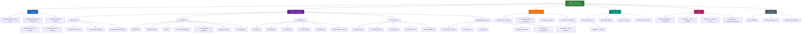

```mermaid
flowchart TD
    A[📊 Instrumentos de Recolección de Información]

    %% Definición
    A --> B[📌 Definición]
    B --> B1[Herramientas para obtener datos]
    B --> B2[Responden preguntas de investigación]
    B --> B3[Permiten comprobar hipótesis]

    %% Tipos
    A --> C[🧩 Tipos de instrumentos]

    C --> C1[📋 Encuestas]
    C1 --> C1A[Preguntas abiertas o cerradas]
    C1 --> C1B[Aplicadas a muchas personas]
    C1 --> C1C[✔ Rápidas y económicas]
    C1 --> C1D[✔ Fácil análisis estadístico]
    C1 --> C1E[❌ Respuestas superficiales]

    C --> C2[🎤 Entrevistas]
    C2 --> C2A[Estructurada]
    C2 --> C2B[Semiestructurada]
    C2 --> C2C[Abierta]
    C2 --> C2D[✔ Información profunda]
    C2 --> C2E[✔ Permite aclarar respuestas]
    C2 --> C2F[❌ Requiere tiempo]
    C2 --> C2G[❌ Posible sesgo]

    C --> C3[👀 Observación]
    C3 --> C3A[Participante]
    C3 --> C3B[No participante]
    C3 --> C3C[✔ Datos reales]
    C3 --> C3D[✔ Contexto natural]
    C3 --> C3E[❌ Subjetividad]
    C3 --> C3F[❌ Difícil registro completo]

    C --> C4[👥 Grupos focales]
    C4 --> C4A[Discusión grupal]
    C4 --> C4B[✔ Opiniones diversas]
    C4 --> C4C[✔ Genera ideas]
    C4 --> C4D[❌ Influencia social]
    C4 --> C4E[❌ Difícil moderación]

    C --> C5[📚 Análisis documental]
    C5 --> C5A[Libros, informes, artículos]
    C5 --> C5B[Bases de datos]
    C5 --> C5C[✔ Bajo costo]
    C5 --> C5D[✔ Información histórica]
    C5 --> C5E[❌ Puede estar desactualizada]

    %% Características
    A --> D[🛠️ Buen instrumento]
    D --> D1[✔ Válido: mide lo correcto]
    D --> D2[✔ Confiable: resultados consistentes]
    D --> D3[✔ Objetivo: sin sesgos]
    D --> D4[✔ Claro: fácil de entender]

    %% Elección
    A --> E[🧠 Cómo elegir]
    E --> E1[Tipo de investigación]
    E1 --> E1A[Cuantitativa → datos numéricos]
    E1 --> E1B[Cualitativa → opiniones]

    E --> E2[Objetivo del estudio]
    E --> E3[Tiempo y recursos]
    E --> E4[Tipo de datos necesarios]

    %% Ejemplo
    A --> F[📌 Ejemplo]
    F --> F1[Pregunta: satisfacción estudiantil]
    F --> F2[Encuesta → medir resultados]
    F --> F3[Entrevista → entender razones]
    F --> F4[Observación → comportamiento en clase]

    %% Importancia
    A --> G[💡 Importancia]
    G --> G1[Datos confiables]
    G --> G2[Base para conclusiones]
    G --> G3[Validez de la investigación]

    %% Colores
    style A fill:#2E7D32,color:#fff
    style B fill:#1565C0,color:#fff
    style C fill:#6A1B9A,color:#fff
    style D fill:#EF6C00,color:#fff
    style E fill:#00897B,color:#fff
    style F fill:#AD1457,color:#fff
    style G fill:#455A64,color:#fff
```
