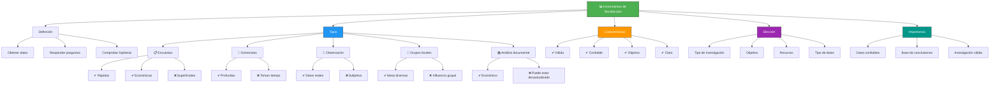

```mermaid
flowchart TD
    A[📊 Instrumentos de Recolección] --> B[Definición]
    A --> C[Tipos]
    A --> D[Características]
    A --> E[Elección]
    A --> F[Importancia]

    B --> B1[Obtener datos]
    B --> B2[Responder preguntas]
    B --> B3[Comprobar hipótesis]

    C --> C1[📋 Encuestas]
    C --> C2[🎤 Entrevistas]
    C --> C3[👀 Observación]
    C --> C4[👥 Grupos focales]
    C --> C5[📚 Análisis documental]

    C1 --> C1A[✔ Rápidas]
    C1 --> C1B[✔ Económicas]
    C1 --> C1C[❌ Superficiales]

    C2 --> C2A[✔ Profundas]
    C2 --> C2B[❌ Toman tiempo]

    C3 --> C3A[✔ Datos reales]
    C3 --> C3B[❌ Subjetiva]

    C4 --> C4A[✔ Ideas diversas]
    C4 --> C4B[❌ Influencia grupal]

    C5 --> C5A[✔ Económico]
    C5 --> C5B[❌ Puede estar desactualizado]

    D --> D1[✔ Válido]
    D --> D2[✔ Confiable]
    D --> D3[✔ Objetivo]
    D --> D4[✔ Claro]

    E --> E1[Tipo de investigación]
    E --> E2[Objetivo]
    E --> E3[Recursos]
    E --> E4[Tipo de datos]

    F --> F1[Datos confiables]
    F --> F2[Base de conclusiones]
    F --> F3[Investigación válida]

    %% Estilos
    style A fill:#4CAF50,stroke:#333,color:#fff
    style C fill:#2196F3,stroke:#333,color:#fff
    style D fill:#FF9800,stroke:#333,color:#fff
    style E fill:#9C27B0,stroke:#333,color:#fff
    style F fill:#009688,stroke:#333,color:#fff
```
