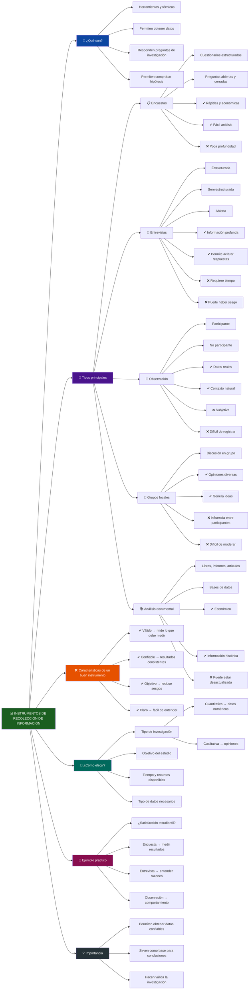

```mermaid
flowchart LR
    A[📊 INSTRUMENTOS DE RECOLECCIÓN DE INFORMACIÓN]

    %% Definición
    A --> B[📌 ¿Qué son?]
    B --> B1[Herramientas y técnicas]
    B --> B2[Permiten obtener datos]
    B --> B3[Responden preguntas de investigación]
    B --> B4[Permiten comprobar hipótesis]

    %% Tipos principales
    A --> C[🧩 Tipos principales]

    C --> C1[📋 Encuestas]
    C1 --> C1A[Cuestionarios estructurados]
    C1 --> C1B[Preguntas abiertas y cerradas]
    C1 --> C1C[✔ Rápidas y económicas]
    C1 --> C1D[✔ Fácil análisis]
    C1 --> C1E[❌ Poca profundidad]

    C --> C2[🎤 Entrevistas]
    C2 --> C2A[Estructurada]
    C2 --> C2B[Semiestructurada]
    C2 --> C2C[Abierta]
    C2 --> C2D[✔ Información profunda]
    C2 --> C2E[✔ Permite aclarar respuestas]
    C2 --> C2F[❌ Requiere tiempo]
    C2 --> C2G[❌ Puede haber sesgo]

    C --> C3[👀 Observación]
    C3 --> C3A[Participante]
    C3 --> C3B[No participante]
    C3 --> C3C[✔ Datos reales]
    C3 --> C3D[✔ Contexto natural]
    C3 --> C3E[❌ Subjetiva]
    C3 --> C3F[❌ Difícil de registrar]

    C --> C4[👥 Grupos focales]
    C4 --> C4A[Discusión en grupo]
    C4 --> C4B[✔ Opiniones diversas]
    C4 --> C4C[✔ Genera ideas]
    C4 --> C4D[❌ Influencia entre participantes]
    C4 --> C4E[❌ Difícil de moderar]

    C --> C5[📚 Análisis documental]
    C5 --> C5A[Libros, informes, artículos]
    C5 --> C5B[Bases de datos]
    C5 --> C5C[✔ Económico]
    C5 --> C5D[✔ Información histórica]
    C5 --> C5E[❌ Puede estar desactualizada]

    %% Características
    A --> D[🛠️ Características de un buen instrumento]
    D --> D1[✔ Válido → mide lo que debe medir]
    D --> D2[✔ Confiable → resultados consistentes]
    D --> D3[✔ Objetivo → reduce sesgos]
    D --> D4[✔ Claro → fácil de entender]

    %% Elección
    A --> E[🧠 ¿Cómo elegir?]
    E --> E1[Tipo de investigación]
    E1 --> E1A[Cuantitativa → datos numéricos]
    E1 --> E1B[Cualitativa → opiniones]

    E --> E2[Objetivo del estudio]
    E --> E3[Tiempo y recursos disponibles]
    E --> E4[Tipo de datos necesarios]

    %% Ejemplo
    A --> F[📌 Ejemplo práctico]
    F --> F1[¿Satisfacción estudiantil?]
    F --> F2[Encuesta → medir resultados]
    F --> F3[Entrevista → entender razones]
    F --> F4[Observación → comportamiento]

    %% Importancia
    A --> G[💡 Importancia]
    G --> G1[Permiten obtener datos confiables]
    G --> G2[Sirven como base para conclusiones]
    G --> G3[Hacen válida la investigación]

    %% Estilos
    style A fill:#1B5E20,color:#fff
    style B fill:#0D47A1,color:#fff
    style C fill:#4A148C,color:#fff
    style D fill:#E65100,color:#fff
    style E fill:#00695C,color:#fff
    style F fill:#880E4F,color:#fff
    style G fill:#263238,color:#fff
```
