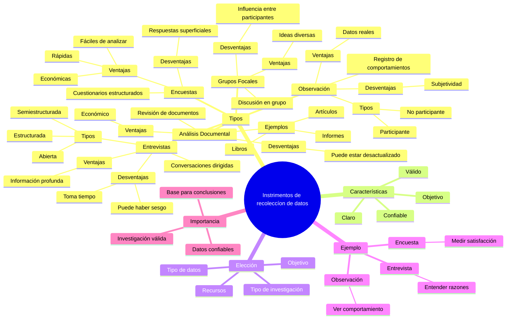

```mermaid
mindmap
  root((Instrimentos de recoleccíon de datos))


    Tipos
      Encuestas
        Cuestionarios estructurados
        Ventajas
          Rápidas
          Económicas
          Fáciles de analizar
        Desventajas
          Respuestas superficiales

      Entrevistas
        Conversaciones dirigidas
        Tipos
          Estructurada
          Semiestructurada
          Abierta
        Ventajas
          Información profunda
        Desventajas
          Toma tiempo
          Puede haber sesgo

      Observación
        Registro de comportamientos
        Tipos
          Participante
          No participante
        Ventajas
          Datos reales
        Desventajas
          Subjetividad

      Grupos Focales
        Discusión en grupo
        Ventajas
          Ideas diversas
        Desventajas
          Influencia entre participantes

      Análisis Documental
        Revisión de documentos
        Ejemplos
          Libros
          Informes
          Artículos
        Ventajas
          Económico
        Desventajas
          Puede estar desactualizado

    Características
      Válido
      Confiable
      Objetivo
      Claro

    Elección
      Tipo de investigación
      Objetivo
      Recursos
      Tipo de datos

    Ejemplo
      Encuesta
        Medir satisfacción
      Entrevista
        Entender razones
      Observación
        Ver comportamiento

    Importancia
      Datos confiables
      Base para conclusiones
      Investigación válida
```
